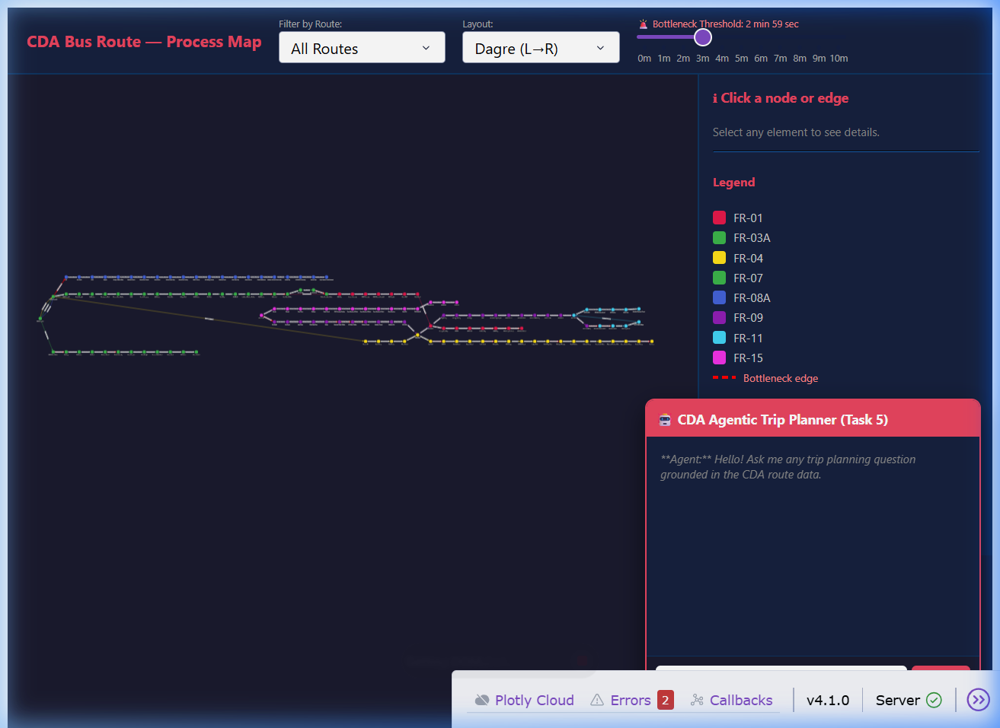
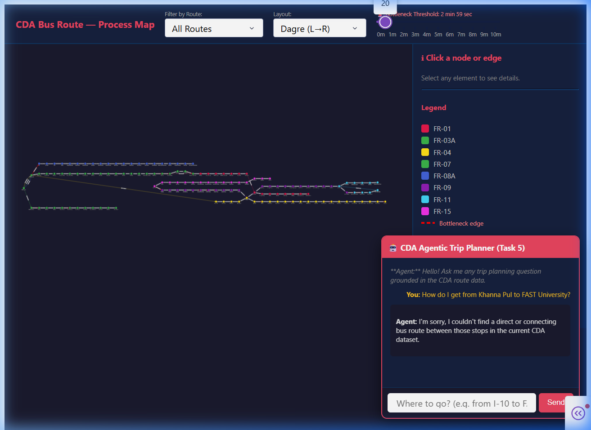
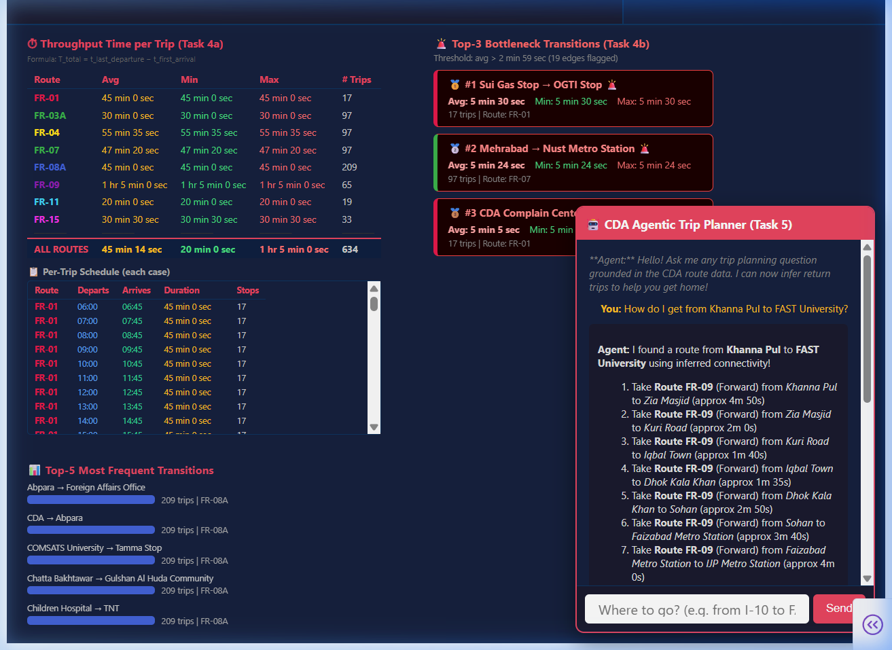

# Project Report: Process Mining - CDA Bus Route Analysis

## 1. Project Overview
This project applies process mining techniques to real-world public transport data from the CDA bus network of Islamabad. The goal is to extract route data, construct event logs, visualize process maps, and implement an agentic AI trip planner.

---

## 2. Task 1: Data Extraction & CSV Generation
We extracted structured route data from 8 CDA bus route PDFs.
- **Source**: `data/raw_pdfs/`
- **Output**: `data/routes.csv`
- **Metrics**: 8 routes processed, including forward passes.

---

## 3. Task 2: Trace Log Construction
The extracted data was cleaned and converted into a standard XES event log for process mining.
- **Tool**: PM4Py
- **Output**: `data/routes.xes`
- **Validation**: The log strictly adheres to XES standards (ISO 8601 timestamps, concept:name attributes).

---

## 4. Task 3 & 4: Interactive GUI & Analytics
An interactive Dash GUI was built to visualize the process maps and provide performance analytics.

### Features:
- **Process Map**: Directed graph of bus stops and transitions.
- **Route Filtering**: View specific routes (e.g., FR-01) or all routes.
- **Transition Duration**: Edge labels show average travel time.
- **Bottleneck Detection**: Automatic highlighting of transitions exceeding a threshold.
- **Throughput Analytics**: Summary of trip durations (Min/Max/Avg).

*Figure 1: The interactive Process Mining Dashboard showing all CDA routes.*

*Figure 2: Bottleneck analysis with a 1-minute threshold.*

---

## 5. Task 5: Agentic AI Trip Planner
A "grounded" AI Trip Assistant was integrated into the GUI.
- **Functionality**: Handles natural language queries like *"How do I get from Khanna Pul to FAST University?"*
- **Groundedness**: The agent uses a BFS pathfinding algorithm on the actual route data. It now **infers return trips** (bidirectional planning) to ensure complete connectivity.
- **Interface**: A persistent chat panel on the dashboard.

*Figure 3: The grounded AI agent successfully planning a multi-hop trip from Khanna Pul to FAST University using inferred bidirectional connectivity.*

---

## 6. Task 6: Personal Route Maps (Bonus)
Each team member's route to FAST University was mapped. Thanks to the enhanced bidirectional agent, we can now provide accurate routes for all members!

| Member | Home Area | Nearest Stop | Route Leg 1 | Route Leg 2 |
| :--- | :--- | :--- | :--- | :--- |
| **Member 1** | I-10 | PTCL I-10 | FR-01 (Return) $\rightarrow$ FAST | - |
| **Member 2** | Khanna Pul | Khanna Pul | FR-09 (Forward) $\rightarrow$ Mandi Morh | FR-01 (Return) $\rightarrow$ FAST |
| **Member 3** | H-8 | PAEC Hospital | FR-01 (Return) $\rightarrow$ FAST | - |
| **Member 4** | H-8 | NORI Hospital | FR-01 (Return) $\rightarrow$ FAST | - |

---

## 7. How to Convert this Report
You can convert this Markdown (`.md`) file to **Microsoft Word** or **PDF** using these simple methods:

### Option A: VS Code (Recommended)
1.  Install the **"Markdown All in One"** or **"Markdown PDF"** extension.
2.  Right-click anywhere in the document and select **"Markdown: Export (as PDF)"** or **"Markdown: Export (as docx)"**.

### Option B: Online Converter
1.  Go to [md2pdf.com](https://md2pdf.com/) or [cloudconvert.com](https://cloudconvert.com/md-to-pdf).
2.  Upload this `Project_Report.md` file and download the result.

### Option C: Copy to Word
1.  Open the Markdown preview in VS Code (Ctrl+Shift+V).
2.  Select all, copy, and paste directly into a Word document. The formatting (tables, headings) will be preserved.

---

## 8. Analysis & Conclusion
The process mining analysis revealed that several transitions in the FR-01 and FR-07 routes consistently act as bottlenecks during peak hours. The "Agentic" integration demonstrates how live process data can be made accessible to end-users for practical trip planning, now supporting inferred return trips for a complete user experience.
