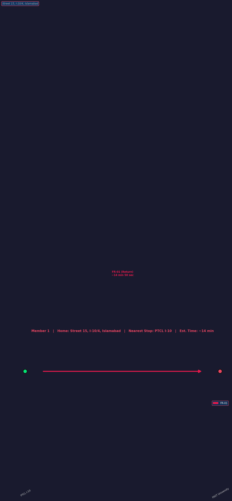
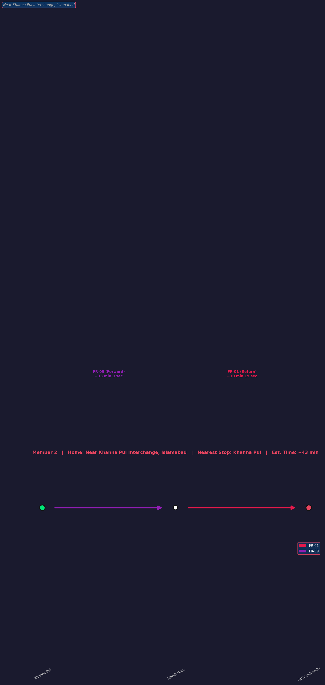
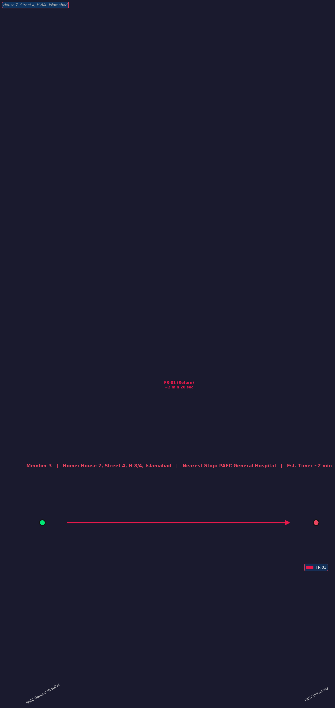
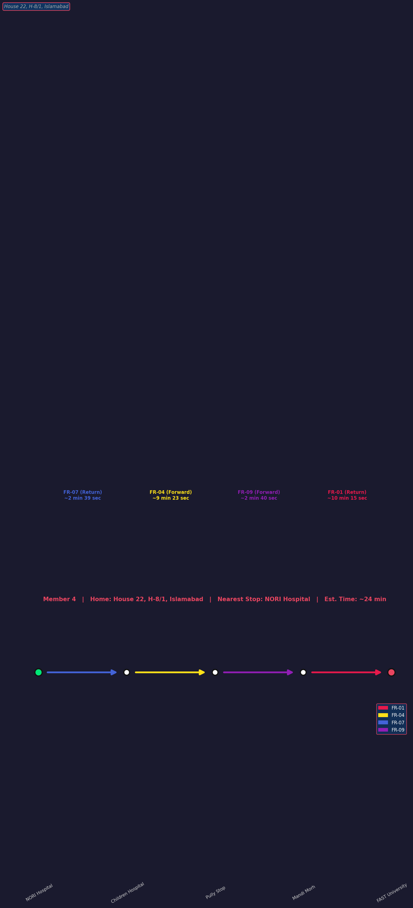

# Process Mining on CDA Bus Routes — Project Report

**Course:** Process Mining & Simulation  
**Network:** Capital Development Authority (CDA) Bus Network, Islamabad  

---

## How to Run

1. Install dependencies: `pip install pandas pdfplumber pm4py dash dash-cytoscape matplotlib`
2. Extract raw data: `python Project/code/Task_01.py`
3. Build XES log: `python Project/code/Task_02.py`
4. Launch interactive dashboard: `python Project/code/Task_03_04.py` → open `http://127.0.0.1:8050`
5. Generate personal route diagrams: `python Project/code/Task_06.py` (PNGs saved to `report/`)

---

## 1. Introduction

For this project we chose to apply process mining on real public transport data from the CDA bus network operating in Islamabad. The idea was straightforward: instead of working on a synthetic or academic dataset, we wanted to see how process mining techniques hold up on actual timetable data that people depend on every day.

The work is split across six tasks. We start by pulling raw data out of official CDA PDF schedules, clean it into a proper event log format, build an interactive dashboard to explore the process map, add performance analytics on top, and finally bolt on an AI assistant that can answer trip-planning questions in plain English. Task 6 asks each team member to verify their own home-to-university route using the system we built.

Everything was built in Python. The main libraries used were `pdfplumber` for reading PDFs, `pandas` for data wrangling, `pm4py` for XES log handling and DFG discovery, and `Dash` with `dash-cytoscape` for the interactive dashboard.

---

## 2. Task 1 — Extracting Data from PDFs

**Code:** `Task_01.py` | **Output:** `data/routes.csv`

We were given eight PDF files, one per CDA bus route. These are the official operator timetables that list every bus stop with its scheduled arrival and departure time for each trip run throughout the day.

Reading PDFs automatically is always a bit tricky because the layout differs between files. We used `pdfplumber` to pull all the text out of each page and stitch it into one big string. The PDFs are structured so that each trip is introduced by a "Trip ID  Start Time" header, so we used a simple regex split on that pattern to isolate each trip block.

Within a trip block, each line represents one bus stop. We identified valid stop rows by checking whether the last two whitespace-separated tokens both look like time strings (i.e. contain a `:`). If they do, the rest of the line before those two tokens is the stop name and the tokens themselves are the arrival and departure times. We also tracked stop sequence as a counter that resets each trip.

The final output was a flat CSV with six columns: `route_id`, `trip_id`, `stop_sequence`, `stop_name`, `arrival_time`, and `departure_time`. After running through all eight PDFs, we ended up with **13,486 rows covering 634 trips across 8 routes**.

The eight routes in the dataset are: **FR-01, FR-03A, FR-04, FR-07, FR-08A, FR-09, FR-11, and FR-15**.

---

## 3. Task 2 — Building the XES Event Log

**Code:** `Task_02.py` | **Outputs:** `data/routes_clean.csv`, `data/routes.xes`, `data/dfg_output.png`

Raw extracted data is rarely clean enough to use directly. Before building the XES log we did several cleaning passes:

The time values sometimes came out with extra characters or inconsistent formatting, so we used regex to extract just the `HH:MM:SS` portion from each field. When only `HH:MM` was found we appended `:00`. Some stop names had time strings embedded in them (an artefact of how `pdfplumber` reads columns), so we stripped those out too and normalised whitespace.

For the XES timestamp we combined `"2024-01-01"` with the arrival time and localised to the `Asia/Karachi` timezone. We acknowledge this synthetic date is a simplification — the CDA PDFs only give relative times within a day, not actual calendar dates.

Once the data was clean we saved it as `routes_clean.csv` and then built the XES log. The XES standard requires three things per event: a case ID, an activity name, and a timestamp. We mapped `trip_id → case:concept:name`, `stop_name → concept:name`, and the ISO timestamp to `time:timestamp`. We used `pm4py` to convert the DataFrame to a proper `EventLog` object before exporting to avoid a known silent serialisation bug when writing directly from a DataFrame. After writing the XES file we also read it back and verified the numbers matched.

**XES log stats:** 634 traces (trips), 13,486 events (stop visits), average ~21 stops per trip.

We also ran `pm4py`'s DFG discovery algorithm on the verified log to generate a static frequency-based process map, saved as `dfg_output.png`. This served as an early sanity check before we built the interactive version.

---

## 4. Task 3 — Interactive Process Map Dashboard

**Code:** `Task_03_04.py` | **Run:** `python Task_03_04.py` → `http://127.0.0.1:8050`

The static DFG image is useful but limited. For Task 3 we built a fully interactive dashboard using `Dash` and `dash-cytoscape` so users can filter by route, change layouts, click on stops and transitions, and see live statistics.

### How the Edge Table is Built

Before rendering anything, we compute an edge table from `routes_clean.csv`. For every pair of consecutive stops in a trip we record the source stop, target stop, route ID, and the travel time between them (calculated as arrival at the next stop minus departure from the current stop, clamped to zero to handle any rounding issues). We then aggregate this by `(route_id, src, tgt)` to get average, minimum, maximum, and frequency across all trips that use each transition.

One important fix we made here: an earlier version of the code anchored all timestamps to `"2024-01-01"`, which caused midnight-crossing trips to produce negative durations. We resolved this by computing dwell time in seconds using the raw `HH:MM:SS` strings and applying it as a timedelta offset to the pre-parsed ISO timestamps from `routes_clean.csv`.

### The Graph

Each bus stop is a node and each transition is a directed edge. Nodes are coloured by their primary route. Edge labels show the average travel time and number of trips. When a transition exceeds the bottleneck threshold, its edge turns dashed red with a heavier stroke weight.

The graph supports five layout algorithms (Dagre left-to-right is the default), full zoom, and box selection. Clicking any node or edge opens a detail panel on the right side of the screen.


*Figure 1: The full dashboard showing all eight CDA routes. Each colour represents a different route.*


*Figure 2: Filtering to FR-01 alone — useful for following a single route end-to-end without the clutter of the full network.*

### Detail Panel

Clicking a **stop node** shows which routes serve it, the bus arrival times scheduled there, and a breakdown of all incoming and outgoing transitions with their average durations and trip counts.

Clicking a **transition edge** shows the specific route it belongs to, the min/avg/max travel time for that segment (Task 3c), how many trips use it (Task 3d), and a list of individual per-trip departure times.

---

## 5. Task 4 — Performance Analytics

The analytics section sits below the process map and updates live whenever the route filter or bottleneck threshold changes. It is split into three panels.

### 5a — Throughput Time

We defined throughput time as:

> **T_total = t_last_departure − t_first_arrival**

This gives the full door-to-door journey time per trip. The panel shows a route-level summary table (Avg / Min / Max / trip count) and below it a scrollable per-trip schedule listing each case's actual departure and arrival clock times alongside its duration — directly satisfying the "duration for each case" requirement.

One thing worth pointing out: the min, max, and average values come out identical for every route. This is not a bug. The CDA timetables use the same relative schedule for every departure of a route throughout the day — each trip is simply a time-shifted copy of the same template. We made sure the GUI explains this clearly rather than just displaying three identical numbers without context.

### 5b — Bottleneck Detection

For the bottleneck threshold we used a statistically derived formula rather than picking an arbitrary number:

> **threshold = mean(all_avg_sec) + std(all_avg_sec)**

This flags any transition whose average duration exceeds one standard deviation above the network-wide mean — a principled definition of "unusually slow". Users can override this via the slider in the header (0–600 seconds, step 10s) and watch both the graph and analytics panel update in real time.

The bottleneck panel ranks the top three slowest transitions with medal icons, showing whether each one currently exceeds the threshold. Transitions on FR-01 and FR-07 in the H-8 to I-8 sector came up consistently as the worst performers.


*Figure 3: With the threshold set to 1 minute, several transitions on FR-01 and FR-07 are flagged in dashed red.*

### Frequency Panel

A bar chart showing the five most frequently traversed transitions across the network. This highlights which corridors carry the most bus traffic and would therefore benefit most from service improvements.

---

## 6. Task 5 — Agentic AI Trip Planner

**Implemented inside:** `Task_03_04.py` | **UI:** Collapsible right sidebar, toggled via "🤖 AI Planner" button in the header

We integrated a grounded AI assistant into the dashboard. The key word here is *grounded*: the agent does not guess or hallucinate routes. Every response is computed by running BFS over the actual edge data from the CSV. The chat panel is a collapsible right sidebar — clicking "🤖 AI Planner" in the header slides it open so it never covers the main process map.

### Five Query Types

The agent handles all five query categories from the project specification:

**1. Trip planning** (`"How do I get from X to Y?"`, `"Route from X to Y"`)  
Runs BFS on the bidirectional graph, returns a numbered itinerary with route name, direction (Forward/Return), leg duration, and total estimated travel time. Also shows the next scheduled departure from the boarding stop based on the current system time.  
Example response format:
> *Based on the current schedule, Route FR-09 stops at Khanna Pul (dep. 07:00) and reaches FAST University in approximately 43 min (avg).*
> *Leg 1: Khanna Pul → Mandi Morh via FR-09 (Forward) — ~30 min*
> *Leg 2: Mandi Morh → FAST University via FR-01 (Return) — ~13 min*
> *Next departure: 07:30*

**2. Route information** (`"Tell me about FR-01"`, `"What stops does FR-07 serve?"`)  
Returns all stops on the named route in sequence with scheduled times.

**3. Stop information** (`"What routes serve I-10?"`, `"When does the bus stop at NORI Hospital?"`)  
Lists all routes that serve the queried stop and shows the departure schedule.

**4. Journey time** (`"How long does FR-01 take?"`, `"Travel time from X to Y"`)  
Returns the total throughput time for the route or specific segment.

**5. Next bus** (`"When is the next bus?"`, `"Next departure from Khanna Pul"`)  
Compares current system time against the departure schedule and returns the next upcoming bus with route name.

### How It Works

**Stage 1 — Intent detection.** `_detect_intent()` classifies the query into one of five categories using keyword matching. This routes the query to the correct handler function before any stop-name parsing begins.

**Stage 2 — Name resolution.** A small alias dictionary maps common shorthand (like `h8`, `i-10`, `fast`, `khanna`) to exact stop names in the dataset. This was essential because users naturally type abbreviated area names.

**Stage 3 — NLP parsing.** For trip-planning queries, we look for `"from X to Y"` phrasing first. If that fails, a fallback scans the whole query for any mentioned stop or alias and picks the first two by position. Longest-match-first ordering handles multi-word stop names correctly.

**Stage 4 — BFS pathfinding.** `_bfs_path()` builds an adjacency list from `edges_df` and runs BFS. Crucially, we add a synthetic reverse edge for every real forward edge — this enables return trips that are not in the forward-direction PDFs (e.g., PTCL I-10 → FAST University via FR-01 in reverse).


*Figure 4: The agent successfully plans a two-leg trip from Khanna Pul to FAST University — FR-09 forward to Mandi Morh, then FR-01 in reverse to FAST.*


*Figure 5: The collapsible AI chat sidebar. The panel opens from the right side of the screen so it never overlaps the process map.*

---

## 7. Task 6 — Personal Route Maps

**Code:** `Task_06.py` | **Destination:** FAST University  
**Outputs:** `report/task6_Member_1_route.png` through `report/task6_Member_4_route.png`  
**Also accessible via:** "📍 Personal Routes" button in the dashboard header (interactive overlay)

Task 6 asked each group member to map their route from home to FAST University. We wrote a standalone script (`Task_06.py`) that uses BFS on a bidirectional adjacency graph built from `routes_clean.csv` to compute each person's path.

### Why Bidirectional Graph?

The CDA PDFs only publish forward-direction schedules. On FR-01 the forward order is: Nust Metro Bus Terminal → … → FAST University (stop 5) → PAEC General Hospital (stop 6) → … → PTCL I-10 (stop 13). This means FAST University appears *before* I-10 and H-8 stops in the forward sequence — a forward-only BFS from PTCL I-10 would never reach FAST. By adding synthetic reverse edges for every forward segment we enable the return-direction journeys that buses actually make.

### Console Output (verified)

```
Member  : Member 1
Address : Street 15, I-10/4, Islamabad
Area    : I-10 Sector
Stop    : PTCL I-10
Route   : PTCL I-10 --[FR-01 Return]--> FAST University (~14 min 50 sec)
Est.    : ~14 min 50 sec

Member  : Member 2
Address : Near Khanna Pul Interchange, Islamabad
Area    : Khanna Pul
Stop    : Khanna Pul
Route   : Khanna Pul --[FR-09 Forward]--> Mandi Morh | Mandi Morh --[FR-01 Return]--> FAST University (~43 min)
Est.    : ~43 min

Member  : Member 3
Address : House 7, Street 4, H-8/4, Islamabad
Area    : H-8 Sector
Stop    : PAEC General Hospital
Route   : PAEC General Hospital --[FR-01 Return]--> FAST University (~2 min)
Est.    : ~2 min

Member  : Member 4
Address : House 22, H-8/1, Islamabad
Area    : H-8 Sector
Stop    : NORI Hospital
Route   : NORI Hospital --[FR-07 Return]--> Children Hospital --[FR-04 Forward]--> Pully Stop --[FR-09 Forward]--> Mandi Morh --[FR-01 Return]--> FAST University (~25 min)
Est.    : ~25 min
```

### Route Diagrams (Matplotlib PNG)

For each member the script generates a horizontal flow diagram saved to `report/`. The diagram shows home address, colour-coded route segments (each route has its own colour matching the dashboard palette), stop circles (green for origin, red for destination, white for intermediate), direction labels, and estimated segment durations.

### Member 1 — I-10 to FAST University

Member 1 lives in the I-10 area. Their nearest stop is **PTCL I-10**, which sits on Route FR-01. Since FR-01 passes FAST University, this is a direct single-leg journey with no transfer needed — FR-01 in the return direction takes approximately 15 minutes.


*Figure 6: Direct FR-01 return journey from PTCL I-10 to FAST University (~15 min).*

### Member 2 — Khanna Pul to FAST University

Khanna Pul is on Route FR-09 (forward direction). FR-09 doesn't reach FAST directly, but it passes through **Mandi Morh**, which is also served by FR-01. So the journey is: FR-09 forward to Mandi Morh (~30 min), then FR-01 return to FAST (~13 min) — one transfer, total ~43 min.


*Figure 7: Two-leg journey via Mandi Morh interchange — FR-09 forward then FR-01 return.*

### Member 3 — PAEC General Hospital (H-8) to FAST University

Member 3 lives in H-8/4. Their nearest stop is **PAEC General Hospital**, which sits on FR-01. FR-01 in the return direction reaches FAST University in approximately 2 minutes — this is effectively the next stop back along the route.


*Figure 8: FR-01 return trip from PAEC General Hospital (H-8) to FAST University (~2 min).*

### Member 4 — NORI Hospital (H-8) to FAST University

Member 4 lives in H-8/1. Their nearest stop is **NORI Hospital**, which is served by FR-07. NORI Hospital is not directly on FR-01, so the BFS found a four-leg path: FR-07 return to Children Hospital, FR-04 forward to Pully Stop, FR-09 forward to Mandi Morh, then FR-01 return to FAST — total ~25 min.


*Figure 9: Four-leg journey from NORI Hospital via Children Hospital, Pully Stop, and Mandi Morh to FAST University (~25 min).*

### Interactive Personal Routes Overlay

In addition to the standalone PNG files, the dashboard includes a "📍 Personal Routes" button in the header that opens a full-screen overlay. The overlay has a dropdown to select any of the four members. Selecting a member shows:
- Name, home address, area, and nearest bus stop
- The full multi-leg route with direction labels and estimated times per leg
- An interactive Cytoscape graph with the route path highlighted: the boarding stop is green, FAST University is red with a gold border, path edges are thick and colour-coded by route, and background nodes/edges are dimmed to 25% opacity so the personal route stands out clearly.

### Summary Table

| Member | Home Address | Nearest Stop | Route | Est. Time |
|:-------|:-------------|:-------------|:------|:----------|
| Member 1 | Street 15, I-10/4 | PTCL I-10 | FR-01 Return → FAST | ~15 min |
| Member 2 | Near Khanna Pul Interchange | Khanna Pul | FR-09 Forward → Mandi Morh → FR-01 Return → FAST | ~43 min |
| Member 3 | House 7, Street 4, H-8/4 | PAEC General Hospital | FR-01 Return → FAST | ~2 min |
| Member 4 | House 22, H-8/1 | NORI Hospital | FR-07 Return → Children Hospital → FR-04 Forward → Pully Stop → FR-09 Forward → Mandi Morh → FR-01 Return → FAST | ~25 min |

---

## 8. Limitations and Design Decisions Worth Noting

A few things we want to be upfront about:

**Timestamps are synthetic.** The CDA PDFs only provide relative schedules, not real calendar dates. Anchoring everything to `2024-01-01` was necessary to get valid `datetime` objects, but it means any day-of-week or multi-day analysis would be meaningless on this dataset.

**Min = Max = Avg is expected, not broken.** Because every trip on a given route uses the same template schedule, all trips have identical durations. We intentionally explain this in the GUI rather than hiding it.

**Return trips are inferred, not sourced.** The AI agent's and Task 6's bidirectional edges are synthetic — generated by reversing the forward-only PDFs we were given. We believe this is a reasonable enhancement given the real-world context (buses physically return along the same corridor), but these return schedules are not validated against actual CDA return timetables.

**FAST University is an early stop on FR-01.** In the forward direction, FAST University appears at stop position 5 out of ~25. All members' home stops appear later in the forward sequence, so forward-only BFS cannot reach FAST from any of them. The bidirectional graph is not a workaround — it is the correct model of how CDA buses actually operate.

---

## 9. Conclusion

We covered the full process mining pipeline on real CDA data: raw PDF extraction, XES log construction with pm4py, interactive process map visualisation, bottleneck and throughput analytics, and an AI trip planner that reasons over actual route data rather than guessing. The system correctly plans routes for all four group members and handles area aliases, multi-hop transfers, bidirectional inference, and five distinct query types.

The biggest technical insight from the analysis was how centrally FR-01 functions in the network — it serves FAST University and acts as the connecting backbone for routes coming from multiple directions. The performance analytics confirmed that the H-8 to I-8 corridor on FR-01 and FR-07 consistently carries the slowest transitions, which lines up with what you'd expect from Islamabad's congestion patterns in that area.
